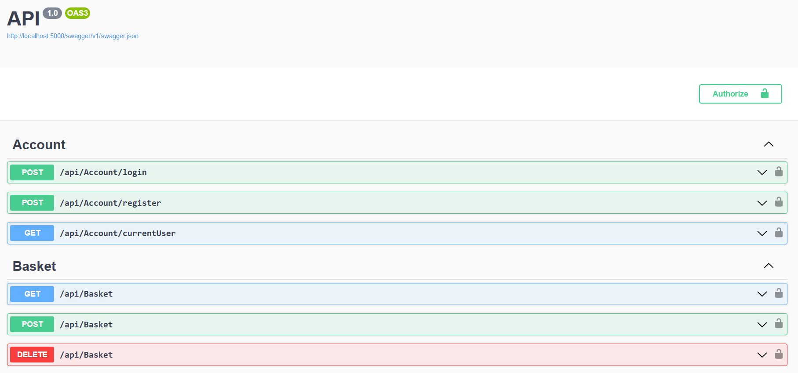
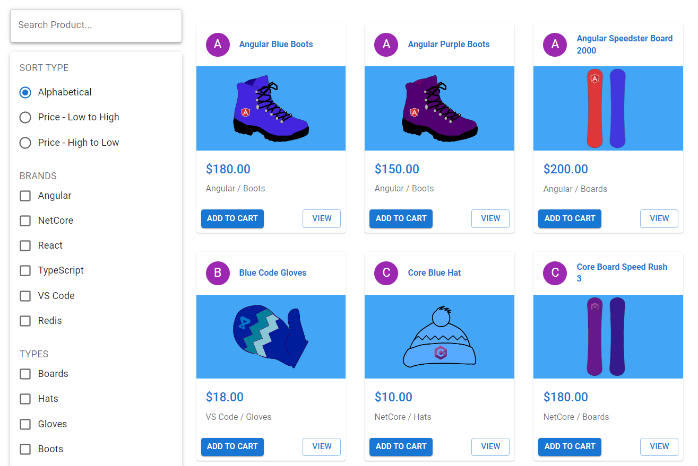
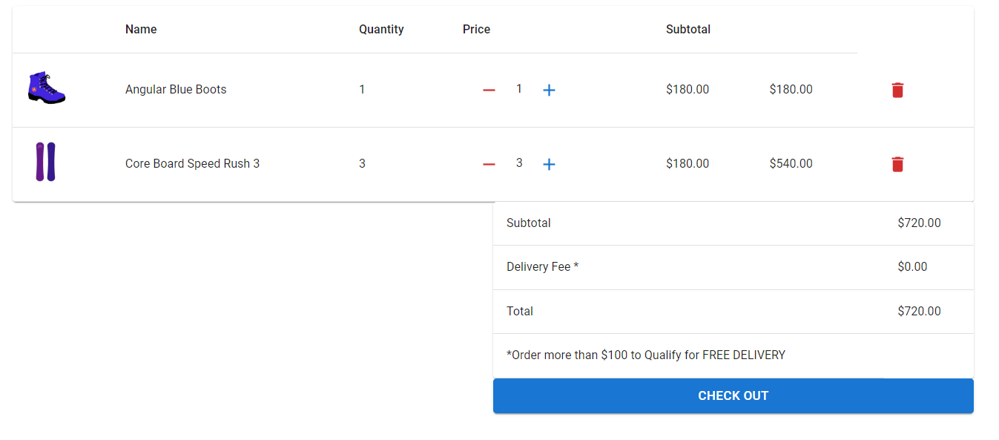

# E-Commerce Store with .NET, React, and Redux

## Overview

This project is part of my journey to learn how to build a real-world application using .NET, React, and Redux. It's based on the course [Learn to Build an E-Commerce Store with .NET, React, and Redux](https://www.udemy.com/course/learn-to-build-an-e-commerce-store-with-dotnet-react-redux).

## Goals

- **Learning**: Gain practical experience by coding along with the course, covering approximately 90% of the lessons.
- **Understanding**: Deepen my understanding of .NET, React, and Redux by building a fully functional E-Commerce application.
- **Skill Development**: Enhance my skills in setting up development environments, creating APIs with .NET WebAPI, developing client-side applications with React, and managing state with Redux.
- **Problem-Solving**: Overcome challenges encountered during development, such as implementing paging, sorting, searching, and filtering features, accepting payments via Stripe, and deploying the application to Heroku.

## API DEMO

## FRONT-END DEMO

## Current Status

This project is a work-in-progress. I'm currently following the course tutorials and actively working on implementing various features and functionalities.

## Course Link

For more details about the course, you can visit the Udemy course page: [Learn to Build an E-Commerce Store with .NET, React, and Redux](https://www.udemy.com/course/learn-to-build-an-e-commerce-store-with-dotnet-react-redux).

